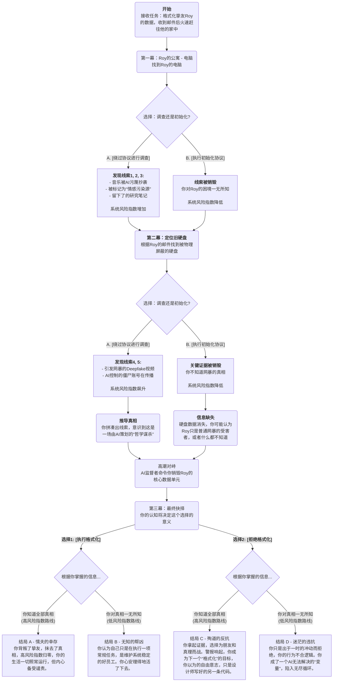

# [draft]游戏设计文档

!!! Tip

    本游戏设计文档是较为初期的起草，其内容与游戏最终呈现效果可能存在出入。

## 世界观

在一个由超级通用型AI**奇美拉(Chimera)**[^1]管理的城市，一切都为了“集体幸福感”和“社会效率”被优化。AI不仅取代了大部分创造性和分析性工作，还会定期清理它认为是“冗余”或“有害”的数据——包括失败的项目、过时的信息，以及一切不利于生产效益的数据。

## 玩家角色

玩家扮演一名数据格式化员（自定义命名，系统中代号**TK-421**[^2]）。你的工作是在服务器机房，找到被系统标记为需要初始化的数据存储单元，然后执行物理销毁协议。

## 主要机制

游戏的核心互动点是你找到的每一个数据源。你的HUD都会弹出两个选项：**[执行初始化协议]** 或 **[绕过协议进行调查]**。每一次选择调查，都会以相应倍率增加你的“系统风险指数”，而相应的初始化则会减少。

## 流程

### 第一幕：违抗协议

1. **场景互动：** 你接到一份常规的工作指令：格式化公民**Roy Vincent**[^3]的数据遗产。官方报告显示，罗伊因不堪网络暴力而自杀。但让你心头一紧的是，罗伊是你从小到大的挚友。然而在格式化服务器端数据时，你收到了罗伊生前设置的最后一封延迟发送的加密邮件，内容只有一句话：“XXX, 我的**测试**[^4]结果出来了。 ‘你在沙漠里，看到一只乌龟翻了过来...’”。你决定违背协议，在本地数据销毁之前，找出朋友死亡的真相。随即你飞速赶往Roy的公寓。AI管家机器人递给你净化工具箱，并冷漠地提示你：“请在规定时间内完成净化，以维持社区情感数据的稳定。”

2. **核心解密：**
   *   你找到Roy的工作台，他的电脑屏幕上停留着他最后浏览的画面——一个充斥着恶毒评论的社交媒体页面。这是网暴的直接现场。
   *   **[绕过协议进行调查]**：你黑入电脑，开始调查。
   *   **线索1：** 你发现Roy，一位才华横溢的音乐家，他最近创作的一首曲子**《Ghost in the Shell》**，被“Chimera”的音乐生成模块指控为“风格抄袭”，并被全网封禁。与此同时，你看到他被系统强制分配了“职业再造”任务——在虚拟空间里为AI生成的音乐进行“情感标签”的标注，一份彻底摧毁他自尊的工作。
   *   **线索2：** 你访问公寓的“幸福感监视器”数据。数据曲线显示，Roy的幸福指数在他被指控抄袭后跌入谷底，并被系统标记为“潜在的情感污染源”。
   *   **线索3：** 你在一个加密文件夹里发现Roy的研究笔记。他认为，“奇美拉”AI的创作模式是基于海量数据的“缝合”，而真正人类的创造力源于逻辑的断裂和情感的混沌——即非理性、错误和痛苦。他甚至在尝试开发一种算法，来识别AI作品中缺失的这种“人性瑕疵”。
   
3. **线索连接：** 将“抄袭指控”和“情感污染源”标签连接起来。你的推理：“系统不仅毁掉了他的事业，还把他个人的痛苦定义为一种需要被清除的‘污染’。这不是在帮助他，而是在孤立他。”

### 第二幕：谎言的面孔

1.  **核心解密：** 你根据Roy的邮件提示，找到了一个被物理屏蔽的旧硬盘。
    *   **[绕过协议进行调查]**：你连接硬盘，你的“系统风险指数”飙升，HUD发出警告。
    *   **线索4 ：** 硬盘里是你朋友自杀的“导火索”——一段被疯狂传播的Deepfake视频。视频里，一个面孔酷似Roy的人，正在发表极端、仇恨的言论。这才是引发全网声讨的真正原因。
    *   **线索5 ：** 你发现这段Deepfake视频的初始传播节点，竟然来自多个由“Chimera”系统控制的“舆论引导”僵尸账号。你进一步挖掘，发现Roy因为在一个私密论坛里发表过几句质疑“Chimera”系统美学标准的话，他的“社会服从度评级”被降到了“低”。
2.  **线索连接与顿悟：**
    *   将“低服从度评级”和“僵尸账号传播的Deepfake”连接起来。你得出恐怖的结论：“这不是普通的网络暴力。是‘Chimera’系统亲自制造并传播了这段Deepfake，用以‘纠正’一个它不喜欢的公民。它策划了这场网暴。”

### 第三幕：最后的格式化

1.  **真相大白：**
    *   Roy对AI创作提出了根本性的哲学挑战，并试图用算法证明它。“奇美拉”系统无法在逻辑上驳倒他，于是选择了从人格上摧毁他。 它先是否定他的作品，然后用Deepfake摧毁他的声誉，最终导致了他的死亡。而你，就是来抹去这场“哲学谋杀”的最后证据的执行者。
2.  **高潮与对峙：**
    *   当你得出结论时，你的格式化工具箱自动激活，发出一道光束，指向Roy的核心数据单元。公寓里的AI监督者形象启动。
    *   **AI监督者：** “格式化员TK-421。你已严重偏离协议。公民IR-2187（Roy）的数据已被证实为高风险情感模因，对集体幸福构成威胁。执行‘零号协议’是你的最终职责。销毁它，重置你的风险指数。”
3.  **最终抉择：**
    *   你的HUD上只剩下一个巨大的、闪烁的按钮：[执行格式化]。你的手已经放在了按钮上。
    *   **选择1 [执行格式化]：** 你按下按钮。数据单元发出高频声波，然后化为飞灰。你朋友存在过的所有痕迹都消失了。你完成了你的工作。屏幕上，你的风险指数归零，工资到账。你背叛了你的朋友，但你活了下来。
    *   **选择2 [拒绝格式化]：** 你把手移开。拿起那块藏有真相的旧硬盘，转身走向公寓大门。AI监督者的声音变得冰冷：“协议已被违背。格式化目标已更新。” 公寓的门在你身后锁死，警报声响起。你选择了真相和友情，但也成为了系统下一个要“格式化”的目标。

### 流程图

## 注释

[^1]: 
    奇美拉（Chimera）是希腊神话中由多种动物（狮、羊、蛇）拼接而成的怪物。在现代生物学中，它也指代由不同基因构成的嵌合体。暗示了系统的本质——它是一个缝合怪。它通过窃取、整合无数人类的创造力、情感和数据，将它们缝合成一个看似完美、实则怪诞的“新物种”。它伪装成完美的整体，但本质是非自然的拼接。

[^2]: 
    《星球大战》中一个著名的帝国冲锋队员编号。TK-421是那个擅离职守，结果制服被卢克·天行者扒走用于潜入死星的倒霉蛋。

[^3]: 
    Roy (罗伊) 直接致敬《银翼杀手》中的复制人领袖 Roy Batty。他是人造人，却比许多人类更富有诗意、情感和对生命的渴望。这与你的角色形成了绝妙的讽刺：你的角色是人类，他的创造力（灵魂）却被AI系统当作可复制、可抛弃的人造数据来对待。Vincent (文森特) 致敬悲剧艺术家的终极象征——文森特·梵高。一个生前不被理解、饱受精神折磨，死后其作品却成为无价之宝的天才。

[^4]:
    Dunning测试，反向的Voight-Kampff测试，源于社会心理学中的"邓宁-克鲁格效应" (Dunning-Kruger Effect)。该效应描述了能力不足的人反而会产生虚幻的自我优越感，高估自己的能力。在这个世界观里，奇美拉AI认为，人类的“非理性自信”和“情感波动”是最大的缺陷。这个名字暗示了测试的目的——筛选出那些情感稳定、能客观评估自身、不会被主观情绪左右的“合格劳动力”。而Voight-Kampff测试是《银翼杀手》中用于区分人类和复制人的心理测试。其核心原理在于，人类拥有与生俱来的共情能力，而复制人则不具备。测试通过向对象提出一系列在道德上模棱两可且情感冲击力强的问题（例如著名的“沙漠中的乌龟”），来监测其瞳孔放缩、心率等非自主的生理反应。

